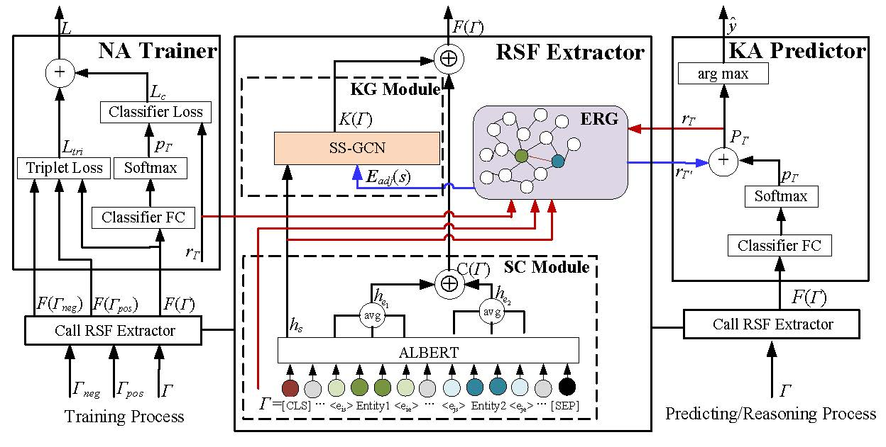

# Fully Exploring Corpus Knowledge for Improved Entity Relation Extraction (ECKRE)
## Introduction

Entity <u>**R**</u>elation <u>**E**</u>xtraction (**RE**) aims to extract the semantic relation between two entities in a given sentence, which is a basic and important task in information extraction and natural language processing. The majority of existing RE methods mainly rely on external knowledge bases or the knowledge of the given sentence to improve their RE performance, but fail to fully explore the various rich knowledge contained in training and/or testing corpuses to improve or revise their RE results. To bridge the gap, for the first time, this paper introduces the concept of a dynamic <u>**E**</u>ntity <u>**R**</u>elation <u>**G**</u>raph (**ERG**), which is first constructed using the training corpus, and then continually expanded as the testing progresses. The ERG is used to globally capture the semantic correlations between entities from all the sentences in the corpus for improved and corrected RE results. After that, a large number of “other”/“no relation” relations retained in the training corpus are selected as negative samples to train to increase the classification performance. Finally, equipped with the light pre-trained language model ALBERT, a proposed <u>**S**</u>emantic <u>**S**</u>imilarity-based <u>**G**</u>raph <u>**C**</u>onvolutional <u>**N**</u>etwork (**SS-GCN**), and joint optimization loss function with the positive-negative samples learning, this paper presents a new RE method, namely **ECKRE** (<u>**E**</u>xploring <u>**C**</u>orpus <u>**K**</u>nowledge for Improved <u>**R**</u>elation <u>**E**</u>xtraction). Extensive experiments on SemEval-2010 Task 8 and TACRED benchmark datasets show that our ECKRE achieves better performance than that of the state-of-the-art methods. 

In this study, we present a new more effiective RE method, namely <u>**ECKRE**</u>. Our contributions can be summarized as follows:


1. We first introduce the concept of a dynamic <u>**E**</u>ntity <u>**R**</u>elation <u>**G**</u>raph (<u>**ERG**</u>), which is first constructed using the training corpus, and then continually expanded as the testing progresses. Our ERG serves to globally capture the semantic relation correlations between two entities from all the sentences in the training and/or testing corpuses for improved RE performance, and to further correct the predicted classification results by the semantic similarity between the related statements.

2. For the first time, we explore a large number of "other"/ "no relation" relations retained in the training corpus as negative samples to train to improve the RE performance. By employing the light pre-trained model ALBERT, a proposed novel <u>**S**</u>emantic <u>**S**</u>imilarity-based <u>**G**</u>raph <u>**C**</u>onvolutional <u>**N**</u>etwork <u>**SS-GCN**</u>, and joint optimization loss function with the positive-negative samples learning, we present a new effiective RE method ECKRE.

3. Extensive experimental results on benchmark datasets SemEval-2010 Task 8 and TACRED show that ECKRE achieves better performance than that of the state-of-the-art RE methods.

To this end, our ECKRE is designed to consist of three components: <u>**R**</u>elation <u>**S**</u>tatement <u>**F**</u>eatures Extractor (<u>**RSF Extractor**</u>), <u>**N**</u>egative <u>**A**</u>ware Trainer ( <u>**NA Trainer**</u>), and <u>**K**</u>nowledge <u>**A**</u>ware Predictor (<u>**KA Predictor**</u>). The pipeline of the entity relation extraction and its neural network model of the proposed ECKRE are shown in Fig.1.



<center>Figure 1. The pipeline of the entity relation extraction and its neural network model of the proposed ECKRE.</center>

## Install & Running
###  Environment
This implementation was written for Python 3.5.x.
```
sklearn==0.0
bert-pytorch==0.0.1a4
torch==1.2.0
transformers==2.3.0
tokenizers==0.0.11
tqdm==4.40.0
wheel==0.33.6
```
### Install Dependencies
```
pip install -r requirements.txt
```
### Running
To train the **ECKRE** model, run the main script `main.py` with command-line arguments. Available arguments are explained with:
```
python main.py --help
```

For benchmark Sem-Eval 2010 Task 8
```bash
python -u main.py \
    --task semeval \
    --data_dir ./data/semeval
```
For benchmark TACRED
```bash
python -u main.py \
    --task tacred \
    --data_dir ./data/tacred
```

## Datasets

We test our method and all baselines on two RE baseline datasets SemEval-2010 task 8 and TACRED, shown in Table 1. For more details on the dataset, please refer to paper [SemEval-2010 Task 8](https://arxiv.org/abs/1911.10422) and [TACRED](https://aclanthology.org/D17-1004.pdf). You can download the whole datasets through [SemEval-2010 task 8](https://www.kaggle.com/drtoshi/semeval2010-task-8-dataset) and [TACRED](https://nlp.stanford.edu/projects/tacred/).

The basic information of data set as follows.

|     Datasets     | Train Size | Test Size | Classes |
| - | :- | -: | -: |
|SemEval-2010 task 8| 8000 | 2717 | 19 |
|TACRED| 90755 | 15509 | 42 |

## Pretrained Model
The pretrained model used in our ECKRE can be download through [https://storage.googleapis.com/albert_models/albert_xxlarge_v1.tar.gz]

## Files

### ECKRE folder

- `main.py` file: the entry file of the whole algorithm program
- `trainer.py` file: training process of the whole network
- `model.py` file: the detailed structure of autoencoder network
- `data_loader.py` file: loading the training and testing sets. 
- `utils.py` file: the calculating process of metric f1 score.

## Comparison Algorithm

We compare our algorithm with 9 state-of-the-art RE methods. The details of these algorithms are as follows

- **C-GCN**

  paper:[https://arxiv.org/abs/1809.10185)

  code: [https://github.com/qipeng/gcn-over-pruned-trees)
  
- **BERT<sub>EM</sub>**

  paper: [https://arxiv.org/abs/1906.03158)

  code:[https://github.com/plkmo/BERT-Relation-Extraction)
  
- **AGGCN**

  paper: [https://arxiv.org/abs/1906.07510)

  code:[https://github.com/Cartus/AGGCN)
  
- **EPGNN**

  paper: [http://proceedings.mlr.press/v101/zhao19a.html)

  
- **LST-AGCN**

  paper: [https://ojs.aaai.org/index.php/AAAI/article/view/6423)

  
- **Student-R**

  paper: [https://ojs.aaai.org/index.php/AAAI/article/view/6509)

  code:[https://github.com/zzysay/KD4NRE)
    
- **GDPNet**

  paper: [https://www.aaai.org/AAAI21Papers/AAAI-3290.XueF.pdf)

  code:[https://github.com/XueFuzhao/GDPNet)
    
- **C-GCN<sub>all+emb</sub>**

  paper: [https://www.cs.huji.ac.il/~oabend/papers/paths_to_relation_extraction.pdf)

  code:[https://github:com/yyellin/gcn-over-semanticrepresentations)
    
- **TaMM**

  paper: [https://aclanthology.org/2021.findings-acl.221.pdf)

  code:[https://github.com/cuhksz-nlp/RE-TaMM)

Note that: the implementation source codes of the baselines EPGNN and LST-AGCN are not provided in their paper, and we only use their experimental results published in their papers respectively. 
    
